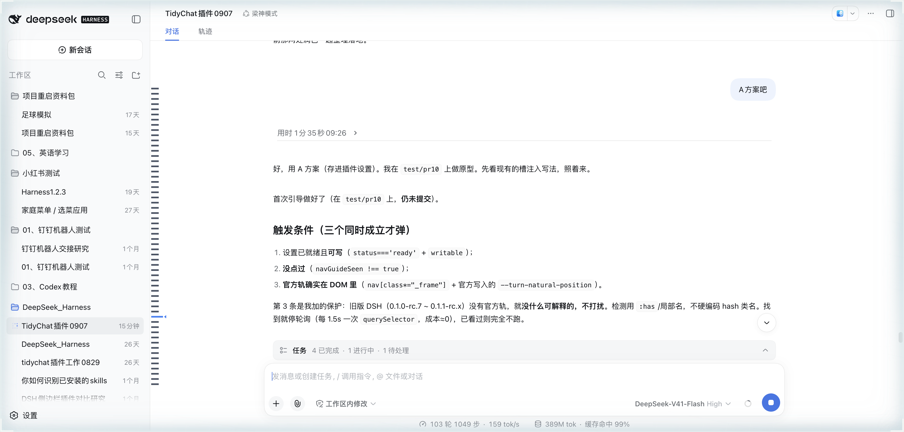
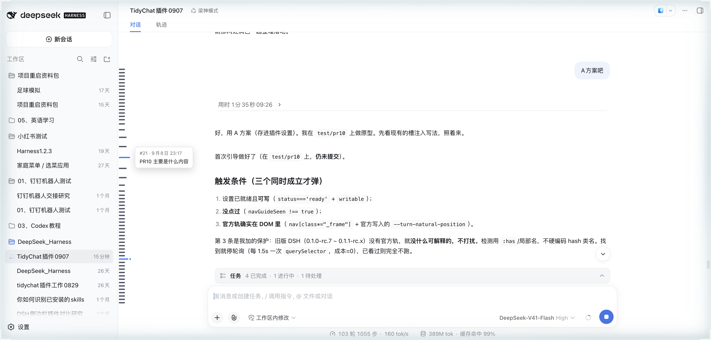
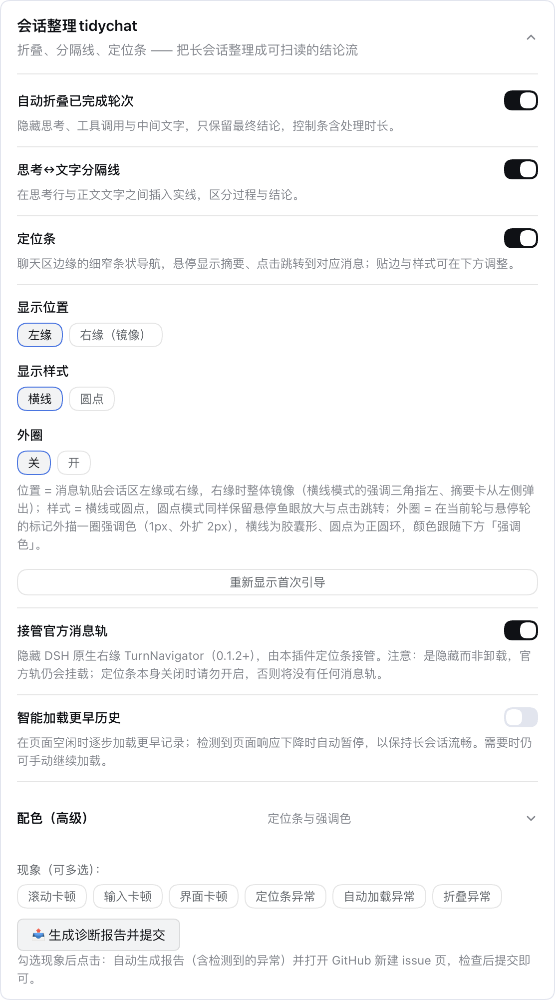

# dsh-tidychat

让 DSH 的长会话变成**可扫读、可跳转**的结论流。

多任务、多轮次的会话里，思考、工具调用、中间文字和最终总结混在一起，回头找「上次那个任务的结论」很费劲。dsh-tidychat 把已完成的任务轮次自动折叠成一条结论，把思考与正文用分隔线切开，并在聊天区左缘提供一条 Codex 式的定位条，让你随时跳回任意一次对话。

> 🔌 生态：挂 `#dsh` · `#dsh-plugin` topic，欢迎收录。

## ✨ 功能

| 功能 | 说明 |
| --- | --- |
| 🗂 自动折叠 | 已完成轮次自动收起思考（Think）、工具调用与中间文字，只保留最终总结；控制条含「过程 N 步」和处理时长（用时 / 首 token / 速率） |
| ➖ 分隔线 | 思考行与正文之间的实线，一眼区分「过程」与「结论」 |
| 📍 左缘定位条 | Codex 式细窄条状导航，每条对应用户消息；悬停弹出摘要卡（含日期时间）、附近条幅联动变长，点击平滑跳转 |
| ⬆ 智能加载更早历史 | 页面空闲时逐步加载更早记录；检测到页面响应开始下降时自动暂停，保持长会话流畅，需要时仍可手动继续加载 |

四个功能各自独立，可在「设置 → 插件配置」里可视化开关，改动即时生效。

## 📸 效果

**自动折叠**：已完成轮次收成一条控制条，只留最终结论（上）；点击「展开」恢复思考、工具调用与中间文字（下）。

<p align="center">
  
  
</p>

**左缘定位条**：细窄条状导航，悬停弹出摘要卡（含日期时间），点击跳转。

<p align="center">
  
</p>

**设置面板**：四个功能独立开关，改动即时生效。

<p align="center">
  
</p>

## 🚀 安装

前置：已安装 DSH（Web 版），`pnpm` 在 PATH 上。

```sh
# 从 GitHub 安装（推荐钉版本，可复现）
dsh plugin --profile web add git+https://github.com/BananaSoldier01/dsh-tidychat.git#v0.1.3
```

安装后重启 dsh web + 硬刷新（Cmd+Shift+R）。

### 更新

插件以 profile 依赖的形式安装，更新就是让 pnpm 重新拉取该依赖的新版本（只拉这个插件，不会重下整个 DSH）：

```sh
# 方式 A：装的是 main 分支（不带 #tag），直接更新到最新
dsh plugin --profile web update @bananasoldier01/dsh-tidychat

# 方式 B：装的是某个 tag，改钉到新 tag 重新 add
dsh plugin --profile web add git+https://github.com/BananaSoldier01/dsh-tidychat.git#v0.1.3
```

更新后同样重启 dsh web + 硬刷新。

> ⚠️ **让设置开关可写（仅 DSH ≤ 0.1.0-rc.6 需要）**：rc.6 及更早版本的「设置 > 插件配置」白名单硬编码在宿主编译产物里，默认不含第三方插件的命名空间，导致开关变灰不可点。运行下面命令把 `tidychat` 加进白名单（幂等；DSH 升级后重跑即可）：
>
> ```sh
> curl -sL https://raw.githubusercontent.com/BananaSoldier01/dsh-tidychat/main/scripts/whitelist-patch.sh | bash
> ```
>
> **DSH ≥ 0.1.0-rc.7 不需要这条**：rc.7 起白名单机制移除，命名空间由插件动态注册，开关自动可点。

> 💡 **版本兼容性**：`0.1.3` 适配 **DSH ≥ 0.1.0-rc.7**（rc.7 把 `settings.plugin.item` 槽从 list 改为 keyed，注册字段由 `id` 改为 `key`，旧版写法会报 "Failed to load plugins"）；**DSH ≤ 0.1.0-rc.6 请使用 `0.1.0`**。

## 🗺️ 路线图

### 0.1.5（计划）—— 稳定性收尾 + 可观测性（低风险）

1. **`governorBusy` 改为 active-session 派生状态** —— 修跨会话 race：A 加载中途切到 B，A 的旧 settle 回调会把全局 `governorBusy` 清掉，破坏「每批只 scan 一次」。状态枚举化（idle/loading/settling/paused/done），`isGovernorBusy()` 从当前会话 status 派生，不另设布尔。
2. **DOM 查询系统收口到会话容器** —— `applySurgery` 主查询、`jumpTo`、`countAnchors`/`findLoadOlderButton` 全部收口到 `[data-conversation-scroll]`（带「容器未挂载回退」守卫）；按钮匹配删除泛化的「加载更多/Load more」，仅匹配会话专属的「加载更早/Load earlier/Load older」。
3. **async cleanup 收口** —— disposers 数组统一清理 setTimeout/requestIdleCallback/settle timer/observer/subscribe；`generation` 守卫保留作第二道防线（cleanup 拦不住已进队列的 callback）。
4. **避免无效扫描** —— 5 秒兜底加 dirty 门（无 mutation 时跳过全量扫描）；applySurgery 期间抑制 observer，防止「scan → 改 DOM → 又触发 scan」的自激循环。
5. **可观测性** —— debug 模式输出性能报告（`turns` / `scan ms` / `nav rendered/total` / `autoload status`），验证 ④ 的效果 + 长会话问题诊断。

### 0.1.6（计划）—— 性能版（单独版本，中高风险）

1. **⏳ 左缘定位条超长优化（方案未定）** —— 定位条 fixed 定位、每轮一根小条，轮次过多会超出屏幕上下被裁切。待定方案：窗口化（只渲染视野附近消息、随滚动更新）、或随会话内容滚动、或其它。方案确定前不实现。
2. **Turn Index 层** —— conversation DOM → Turn Index（id/element/position/summary），fold/navigator/autoload 共享索引，替代每次全量扫描；基于索引的增量维护（等真实 500+/1000+ 行数据再定方案）。

### 候选 / 待定

- **运行中回合的已完成步骤折叠**（issue #2）—— 新功能需求：单轮内 LLM 执行大量动作时，运行中实时折叠已完成步骤。需求强度待验证，0.1.6 之后再说。

### 本地开发（link 模式）

```sh
git clone https://github.com/BananaSoldier01/dsh-tidychat.git
cd dsh-tidychat
pnpm install
dsh plugin --profile web add link:$PWD
```

改源码后 `pnpm run build`，重启 dsh web / 硬刷新即生效。

## ⚙️ 设置

在「设置 → 插件配置」展开 **dsh-tidychat** 卡片：

- **自动折叠已完成轮次**：隐藏思考、工具调用与中间文字，只保留最终结论，控制条含处理时长。
- **思考↔文字分隔线**：在思考行与正文文字之间插入实线，区分过程与结论。
- **左缘定位条**：聊天区左缘的细窄条状导航，悬停显示摘要、点击跳转到对应消息。
- **智能加载更早历史**：页面空闲时逐步加载更早记录；检测到页面响应下降时自动暂停，保持长会话流畅，需要时仍可手动继续。

## 🔧 原理

纯浏览器半（`exports "./client"`）实现，host 半只注册 settings 命名空间，不修改任何 DSH 源码：

- 折叠 / 分隔 / 导航全部通过 DOM 结构锚点（`data-chat-anchor-key`、`data-variant="think"` 等契约级属性）定位，不依赖编译期 hash 类名；
- 通过 `MutationObserver` 观察会话 DOM，配合定时兜底扫描，处理流式渲染与历史加载带来的 DOM 变化；
- 展开 / 收起状态为会话内内存态，刷新后恢复默认（全部折叠）。

## 🧑‍💻 开发

```sh
pnpm install
pnpm run build      # tsdown 构建 lib/
pnpm run typecheck
```

## 📄 License

MIT
