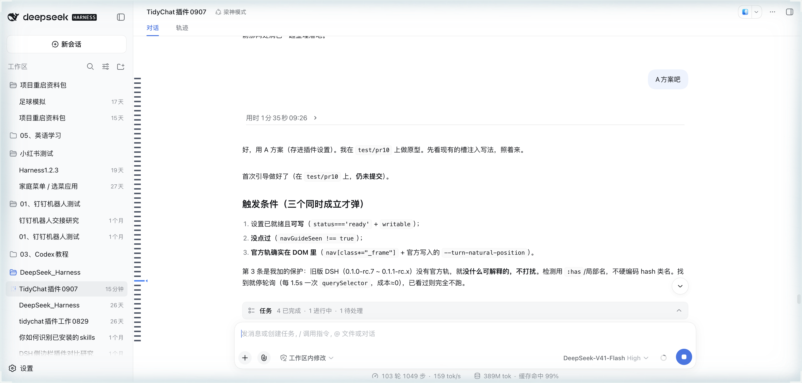
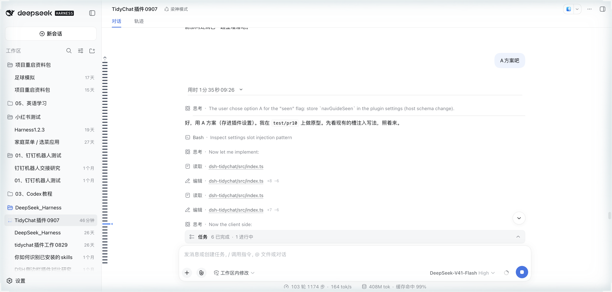
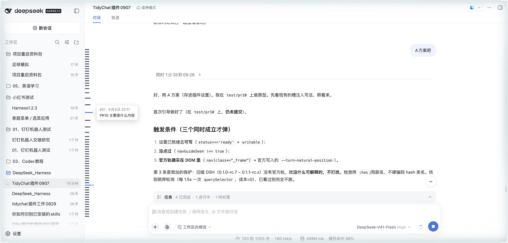
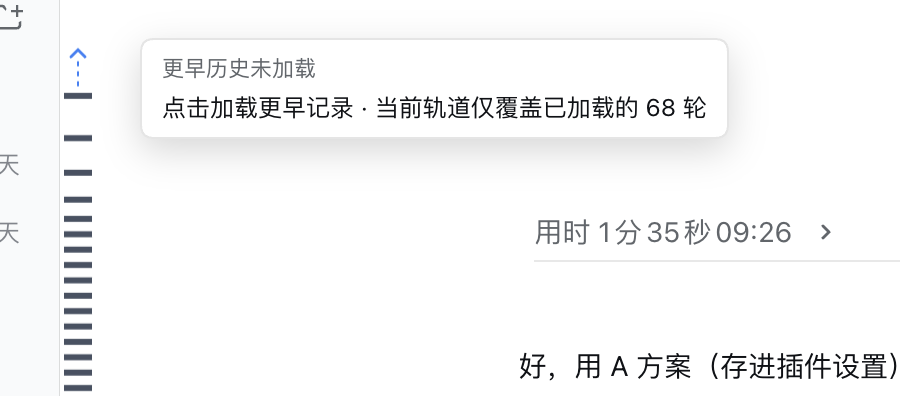
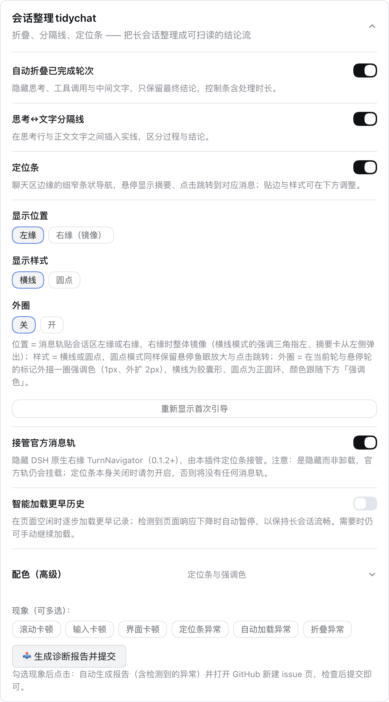

# dsh-tidychat

> 🌐 [English](./README.en.md)

> 🧩 [DeepSeek Harness](https://github.com/deepseek-ai/deepseek-harness)（`dsh`）Web 插件，已收录于社区列表 [awesome-dsh-plugin](https://github.com/awesome-dsh-plugin/awesome-dsh-plugin)。

让 DSH 的长会话变成**可扫读、可跳转**的结论流。

多任务、多轮次的会话里，思考、工具调用、中间文字和最终总结混在一起，回头找「上次那个任务的结论」很费劲。dsh-tidychat 把已完成的任务轮次折叠成一条结论、把思考与正文用分隔线切开，并在聊天区边缘提供 Codex 式导航消息轨（Canvas minimap）。

> **维护定位（0.4.0 起）**：DSH 官方 Web 已覆盖折叠、消息轨等大量重叠能力。本插件**暂以兼容性维护为主**——跟住宿主设置面 / DOM 契约变更，保证在目标 DSH 版本上可装可用；不再以功能扩张为优先。仍适合：想用插件轨的贴边/样式/配色、接管官方轨、智能加载更早历史，或留在 DSH 0.1.x（请用 **0.3.1**）的用户。

## ✨ 功能

| 功能 | 说明 |
| --- | --- |
| 🗂 自动折叠 | 已完成轮次收起思考（Think）、工具调用与中间文字，只留最终总结；控制条含「过程 N 步」与处理时长 |
| ➖ 分隔线 | 思考行与正文之间的实线，一眼区分「过程」与「结论」 |
| 📍 消息轨 | 聊天区边缘的全局导航：鱼眼悬停、拖动预览、点击跳转、当前轮高亮。可贴**左缘或右缘**（右缘整体镜像），样式**横线 / 圆点**，另有独立**外圈**开关；配色自适应或调色盘自定义。更早历史未加载时，轨道顶部出现箭头提示，点击即加载 |
| 🎛 接管官方消息轨 | 隐藏 DSH 0.1.2+ 原生右缘 TurnNavigator，由本插件消息轨接管（默认关；是隐藏而非卸载） |
| ⬆ 智能加载更早历史 | 空闲时逐步加载更早记录，检测到响应下降自动暂停，需要时仍可手动继续 |
| 📤 一键报告问题 | 生成诊断报告（版本 / 浏览器 / 性能数据 / 异常检测 / 现象标签），一键打开预填好的 GitHub issue |

五项开关各自独立（「设置 → 内置插件 → 会话整理 tidychat」，改动即时生效）。在 DSH 0.2.x 上首次出现「插件轨 + 官方轨并存」时会弹一次向导讲清「左缘 = 插件 / 右缘 = 官方」，并可直接三选一。

## 📸 效果

**自动折叠**：已完成轮次收成一条控制条，只留最终结论（上）；点击「展开」恢复思考、工具调用与中间文字（下）。

<p align="center">
  
  
</p>

**消息轨**：可贴左缘或右缘，样式可选横线 / 圆点，外圈可独立开关。悬停显示该轮摘要，点击跳转。

<p align="center">
  
  
</p>

**更早历史未加载时**（上方还有未挂载的轮次，常见于刚打开长会话）：轨道顶部出现箭头 + 虚线，悬停说明当前覆盖范围，**点击即加载更早记录**。

<p align="center">
  
</p>

**设置卡片**：5 个开关（折叠 / 分隔线 / 定位条 / 接管官方消息轨 / 智能加载更早历史）+ 消息轨的显示位置 · 样式 · 外圈 + 配色 + 现象标签与一键诊断报告。

<p align="center">
  
</p>

## 🚀 安装

前置：已安装 DSH（Web 版），`pnpm` 在 PATH 上。

```sh
# 方式 1（推荐）：npm 包，预构建产物免 allowBuilds 授权
dsh plugin --profile web add @bananasoldier01/dsh-tidychat

# 方式 2：从 GitHub 安装（推荐钉版本，可复现）
dsh plugin --profile web add git+https://github.com/BananaSoldier01/dsh-tidychat.git#v0.4.0
```

安装后重启 dsh web + 硬刷新（Cmd+Shift+R）。**0.4.0 只适用于 DSH 0.2.x**。

### 更新

插件以 profile 依赖的形式安装，更新就是让 pnpm 重新拉取该依赖的新版本（只拉这个插件，不会重下整个 DSH）：

```sh
# 方式 A：npm 方式安装，直接更新
dsh plugin --profile web update @bananasoldier01/dsh-tidychat

# 方式 B：装的是某个 tag，改钉到新 tag 重新 add
dsh plugin --profile web add git+https://github.com/BananaSoldier01/dsh-tidychat.git#v0.4.0
```

更新后同样重启 dsh web + 硬刷新。

> ⚠️ **版本线不能混用**。DSH 0.1.7 起删除了命令式 `settings.register` / `installSection`，改成 Config `.volatile()` 声明式设置；`.volatile()` 在 0.1.6 上调用即抛 `TypeError`。**一份构建无法同时支持 ≤0.1.6 与 ≥0.1.7**。
>
> | 插件 | DSH |
> | --- | --- |
> | **0.4.0+**（本线，npm dist-tag `dsh-0.2`） | **0.2.x** |
> | **0.3.1**（0.1.0-rc.7 ~ 0.1.6 的最后一版） | 0.1.0-rc.7 ~ 0.1.6 |
> | `0.1.0` | ≤ 0.1.0-rc.6（需白名单补丁，见下） |
>
> DSH 0.1.7 不在这两条线上：0.3.1 的注册 API 已被删除，0.4.0 的 peer 只接受 0.2.x。请把宿主升到 0.2.x 再装 0.4.0。
>
> **仅 DSH ≤ 0.1.0-rc.6**（插件 `0.1.0`）：宿主白名单硬编码，第三方开关会变灰不可点，需跑一次 `scripts/whitelist-patch.sh`（幂等）：
>
> ```sh
> curl -sL https://raw.githubusercontent.com/BananaSoldier01/dsh-tidychat/main/scripts/whitelist-patch.sh | bash
> ```

## 🧩 兼容性

| 插件版本 | DSH 版本 | 设置面 |
| --- | --- | --- |
| **0.4.0+** | **0.2.x**（按 0.2.0-rc.2 核对） | 声明式：Config `.volatile()` 自动成表；浏览器半 `ctx.configForms.get('tidychat')`；自带设置卡挂 `settings.plugins.tab` |
| **0.3.1**（该区间最后一版） | 0.1.0-rc.7 ~ 0.1.6 | 命令式：`register`（至 0.1.1）/ `installSection`（0.1.2 ~ 0.1.6）。折叠 / 分隔线 / 自动加载自插件 0.2.8 起可用；消息轨自 **0.3.0** 起可用（0.2.10 及更早取数路径读错快照，轨道解析出 0 轮、实际从未渲染） |

- DSH 0.1.2 起官方已有「折叠过程内容」与右缘 TurnNavigator；**0.2.x 上官方能力更完整**，与插件大量重叠。多数场景可只用官方；需要本插件轨的贴边/样式/配色或「接管官方消息轨」时再开对应开关（否则易双折叠 / 左右双轨）。
- 接管是**隐藏而非卸载**：宿主未提供原生开关，开启后官方组件仍会挂载（DOM 保留），停掉的是绘制、布局、交互与滚动跟随。0.2.0-rc.2 的官方轨改为虚拟列表，不再写 `--turn-natural-position`；隐藏改锚在 `div.*_slot > nav.*_frame` 结构上（不硬编码 CSS Module hash）。

## ⚙️ 设置

在「设置 → 内置插件」打开 **会话整理 tidychat** 标签（改动即时生效）：

| 项 | 配置键 | 默认 | 说明 |
| --- | --- | --- | --- |
| 自动折叠已完成轮次 | `fold` | 开 | 隐藏思考、工具调用与中间文字，只保留最终结论 |
| 思考↔文字分隔线 | `divider` | 开 | 在思考行与正文之间插入实线 |
| 定位条 | `navigator` | 开 | 聊天区边缘的细窄条状导航；**关闭后没有任何插件轨** |
| 接管官方消息轨 | `hideOfficialNav` | 关 | 隐藏 DSH 0.1.2+ 原生右缘 TurnNavigator；定位条关闭时请勿开启 |
| 智能加载更早历史 | `autoLoad` | 开 | 空闲时逐步加载更早记录，响应下降自动暂停 |
| 显示位置 | `navSide` | 左缘 | `left` / `right`（右缘整体镜像：横线向左生长、强调三角指左、悬停摘要从鼠标左侧弹出） |
| 显示样式 | `navStyle` | 横线 | `bar` 横线 / `dot` 圆点，两者都保留鱼眼放大与点击跳转 |
| 外圈 | `navRing` | 关 | 当前轮与悬停轮的标记外描一圈强调色（1px、外扩 2px）；横线取胶囊形、圆点取正圆环 |
| 配色（高级，可折叠） | `navColor` `navAccent` 等 | 自动 | 默认色 / 强调色各自「自动 / 自定义」。自动：默认色用宿主淡色文字色，与聊天区背景对比不足时切纠偏灰，强调色跟随主题品牌色；自定义：原生取色器无极调色，或输入 HEX / `rgb()` / `rgba()` + 透明度滑杆。强调色同时决定当前轮 / 悬停轮高亮与外圈描边 |
| 首次引导 | `navGuideSeen` | 关 | 两轨并存时弹一次向导；卡片内「重新显示首次引导」可随时召回 |

> 默认值变更只影响新装——已装用户的旧默认值已物化在设置里，历史上的 `navigator: false` 需手动打开。

## 🔧 原理

纯浏览器半（`exports "./client"`）实现。host 半只声明带 `.volatile()` 的 Config schema，不注册命名空间，也不修改任何 DSH 源码：

- 折叠 / 分隔 / 导航全部通过 DOM 结构锚点（`data-chat-anchor-key`、`data-variant="think"` 等契约级属性）定位，不依赖编译期 hash 类名；`MutationObserver` 观察会话 DOM，配合定时兜底扫描，处理流式渲染与历史加载。
- 展开 / 收起状态为会话内内存态，刷新后恢复默认（全部折叠）。
- 「接管官方消息轨」同样不依赖编译期 hash：官方 TurnNavigator 的类名是 CSS Module 产物。0.2 的结构是 `div.*_slot > nav.*_frame`（虚拟列表，不再写 `--turn-natural-position`），插件按这个结构隐藏；关闭时仅移除根元素上的 `data-tidychat-hide-official-nav` 属性即可恢复。

## 🗺️ 路线图

逐版本变更见 [`CHANGELOG.md`](./CHANGELOG.md)。**当前阶段：兼容性维护**（跟 DSH 0.2.x 设置面与 DOM 契约），不做功能扩张。若上游破坏性变更或安装门需要跟进，再发补丁版。

历史候选（暂缓）：Turn Index 层、运行中步骤折叠（issue #2）、向上游申请官方轨原生开关。

## 🧑‍💻 开发

```sh
git clone https://github.com/BananaSoldier01/dsh-tidychat.git
cd dsh-tidychat && pnpm install
dsh plugin --profile web add link:$PWD   # link 模式：改源码后 pnpm run build，重启 dsh web / 硬刷新即生效
```

```sh
pnpm run build      # tsdown 构建 lib/
pnpm run typecheck
```

## 📄 License

MIT
